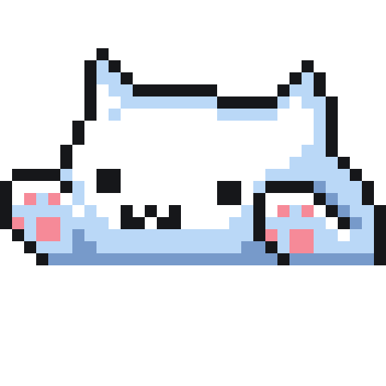
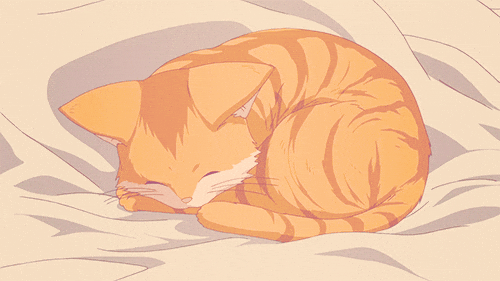

    <h1>
    
    
    
        </h1>

Je suis Sarah Wechselgaertner, une étudiante en informatique qui essaie de mener à bien ses projets. Je passe la plupart du temps à les perfectionner esthétiquement quand cela est possible.

### My top project 

## Langages que je connais

 

## Mes différents supports de travail

    

#

    sur ce, bonne nuit...
     
    

